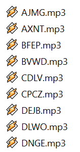

# Mp3Rename

A simple tool that uses ID3v2 metadata to rename mp3 files in the format of `<artist name>` - `<song title>`.mp3

## Why make this?

Recently, I used a third-party tool to extract mp3s from an old iPod and the result was this:



I like my mp3 file names looking pretty. This was not pretty. I was compelled to do something about it, and the result was this tool.

## How to use

Specify the directory as a command line argument for the tool.

#### Examples:

```bash
python mp3rename.py C:\Music\mp3 files\
```
```bash
./mp3rename.py /home/user/mp3 files
```

If other directories exist within the provided directory, the user will be prompted whether or not to recurse through each, renaming any mp3 files found.